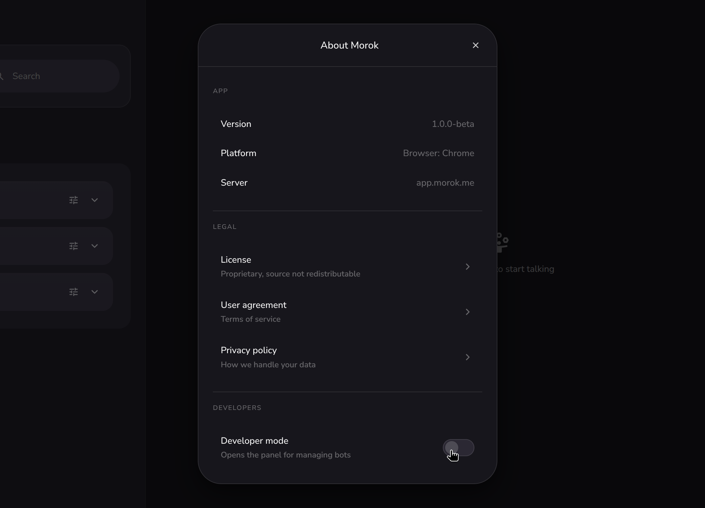
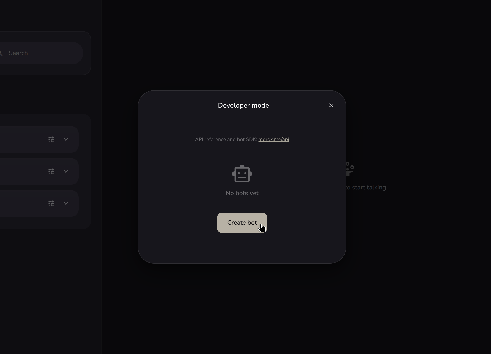
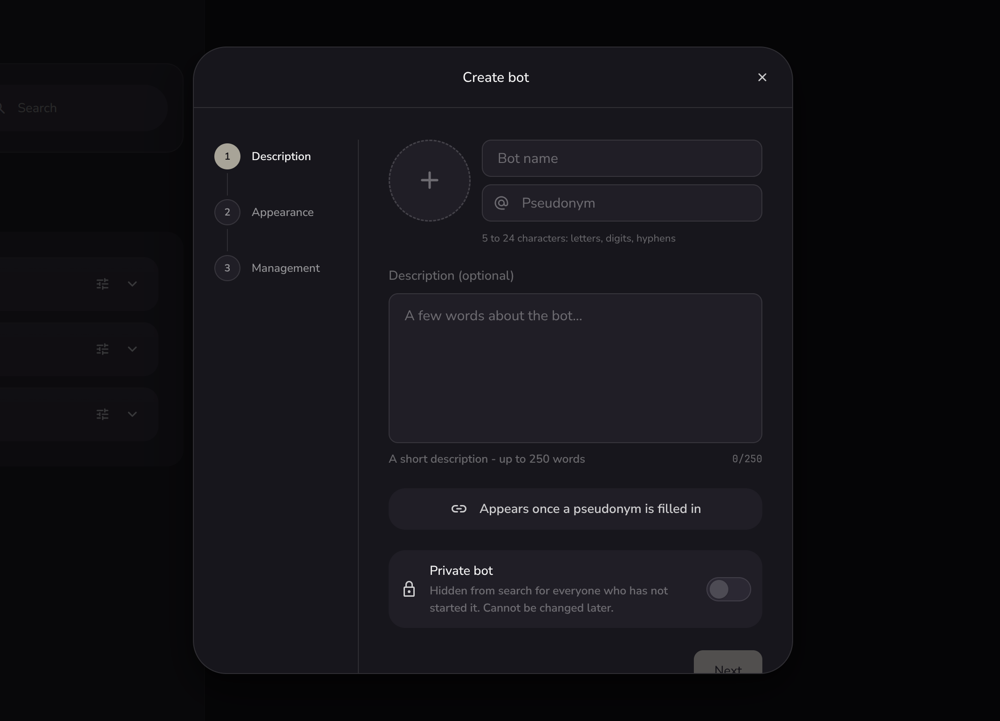
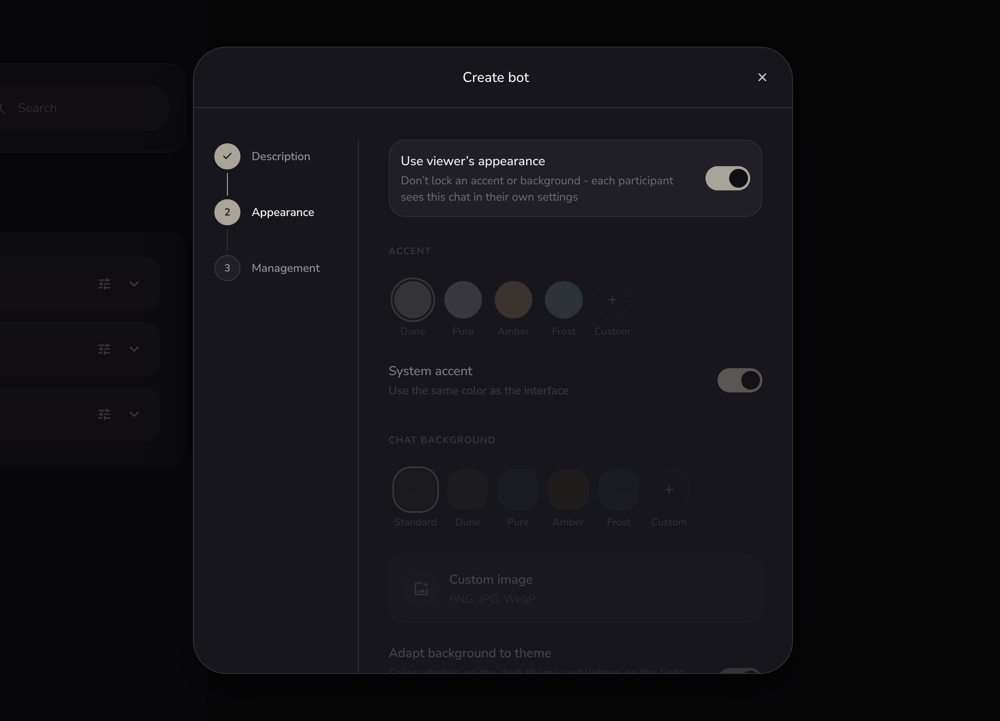
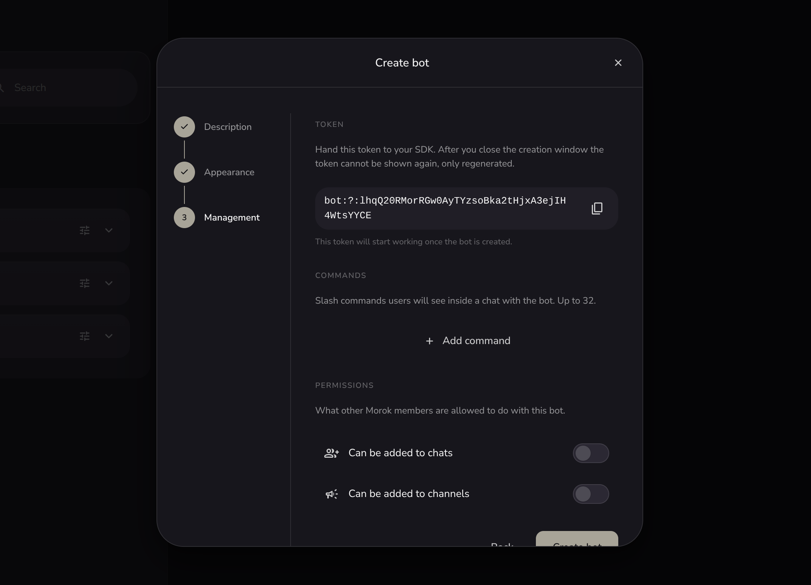
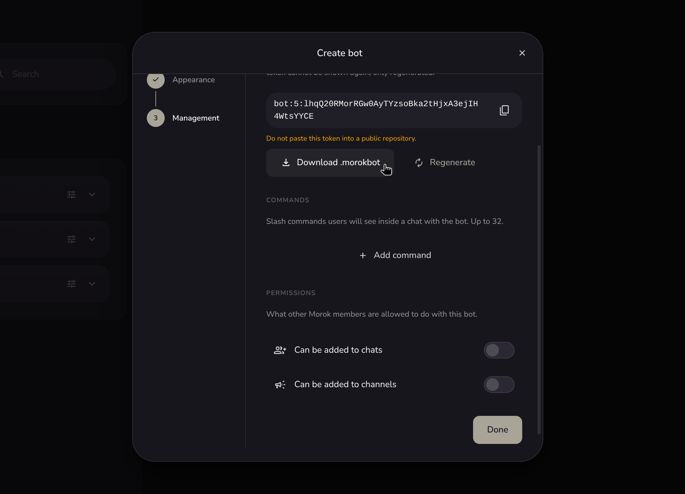

# Getting started

A walkthrough for building your first Morok bot. Includes developer-panel screenshots, the `.morokbot` token, the SDK install, and the first echo handler.

Русская версия: [getting-started.ru.md](./getting-started.ru.md).

## 1. Enable developer mode

In the Morok app: **Settings -> About Morok**, flip the **Developer mode** toggle. A section of the same name appears in Settings.



## 2. Open the Developer mode tab

**Settings -> Developer mode**. Empty on first visit, with one button: **Create bot**.



Each owner can have up to 10 bots. Deleted bots free the slot immediately.

## 3. Wizard step 1: Description

Avatar (an uploaded image or a unicode symbol), name (up to 64 chars), the pseudonym (5 to 24 characters, `[a-zA-Z0-9-]`), a description (up to 250 chars), and a **Private bot** toggle. A `-bot` suffix is appended to the pseudonym automatically. Name, description and avatar can be changed later, the pseudonym and the private flag are set once at creation.



If the resulting pseudonym is already taken, the wizard tells you on the spot. A private bot is hidden from search for anyone who has not started it.

## 4. Wizard step 2: Appearance

Theming for the chat with the bot: accent colour, wallpaper and background pattern. The same settings as group chats and channels.



## 5. Wizard step 3: Management

This step does three things:

1. **Token**. The wizard generates and shows the token right away, exactly once — copy it with the copy-icon button. Downloading it as the whole `.morokbot` file (step 6) only becomes possible after you press **Create bot** at the very end: that is when the token is committed to the bot and the download and regenerate options appear.
2. **Commands**. Up to 32 slash commands (e.g. `/help`, `/start`). A command name is lowercase letters, digits and underscores, starts with a letter, up to 32 chars. Descriptions are shown to users in the bot's command list.
3. **Permissions**. Two toggles: "Can be added to chats" and "Can be added to channels". Both default to off.



The token is shown exactly once. If you lose it, regenerate it in the bot's Edit screen.

## 6. Download the .morokbot file

The **Download .morokbot** button appears only after you press **Create bot** at the very end of the wizard, next to the revealed token. It bundles the token together with the freshly generated Signal key material (identity key, signed prekey, one-time prekey pool) into a single JSON file.



The file holds the bot's private keys. Lock down access to it:

```bash
chmod 0600 ./bot.morokbot
echo '*.morokbot' >> .gitignore
echo 'bot-state/' >> .gitignore
```

The SDK's `examples/.gitignore` already covers both.

## 7. Install the SDK

```bash
npm install morok-bot-sdk
```

Node 22+. See [README §Install](../README.md#install) for the full list of runtime requirements.

## 8. First handler

```ts
import { MorokBot } from 'morok-bot-sdk'

const bot = await MorokBot.fromFile({ tokenFile: './bot.morokbot' })

bot.on('message', async (m) => {
    if (m.text) await bot.reply(m, { text: `echo: ${m.text}` })
})

await bot.start()
console.log('bot is up')
```

Run it: `node --experimental-strip-types index.ts` (or after `npm run build`: `node dist/index.js`). The first run creates `bot-state/` next to your code.

## 9. Press "Start" in the chat with the bot

Open a chat with your bot. The first time you visit, you'll see a **Start** button at the bottom instead of a message composer.

Press it. The SDK fires a `bot.on('start', ...)` event, the composer unlocks, and from this moment on your bot can message that user directly. To withdraw consent later, the bot's profile has a **Stop** row.

## 10. Managing the bot later

In the Developer mode tab, each bot has two actions:

| Action | What it does                                                                                       |
|--------|----------------------------------------------------------------------------------------------------|
| Edit   | Everything except the pseudonym and the private flag: name, description, avatar, appearance, commands, permissions. |
| Delete | Soft-delete. The pseudonym is freed immediately, and all peers receive a `user_deleted` event.     |

Inside Edit there is a separate **Regenerate** token button. Use it if the original token leaked. Behaviour:

- The server revokes the old token and closes any live sessions.
- The wizard shows a fresh token once.
- Replace the `token` field in your `.morokbot` (everything else, identity and prekeys, stays the same).
- Restart the SDK.

If you also lose the key material, you have to delete and recreate the bot. Deleting a bot removes its account entirely: to peers it turns into a deleted account and drops out of search. The recreated bot is a separate account even under the same pseudonym, and consent does not carry over, so each peer has to find the bot again and press "Start".

## Where to go next

- [README §Quickstart](../README.md#quickstart): a fuller echo bot, with start/stop events, a /help command, and disconnect/error handling.
- [docs/deployment.md](./deployment.md): systemd, Docker, backups, monitoring.
- [api.md](https://morok.me/api): HTTP and WebSocket reference.
- [README §Troubleshooting](../README.md#troubleshooting): what to do when something goes wrong.
